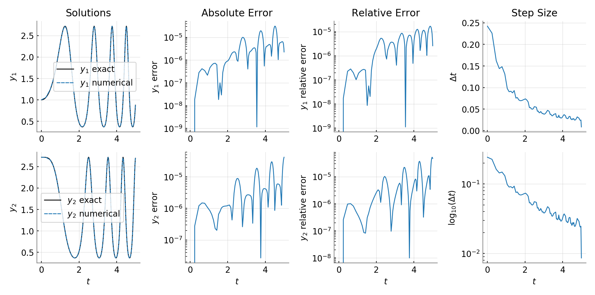
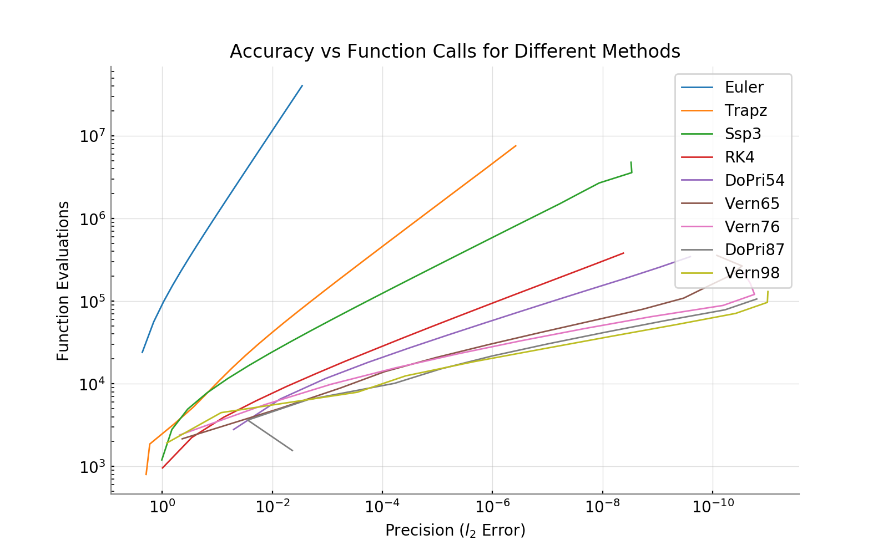
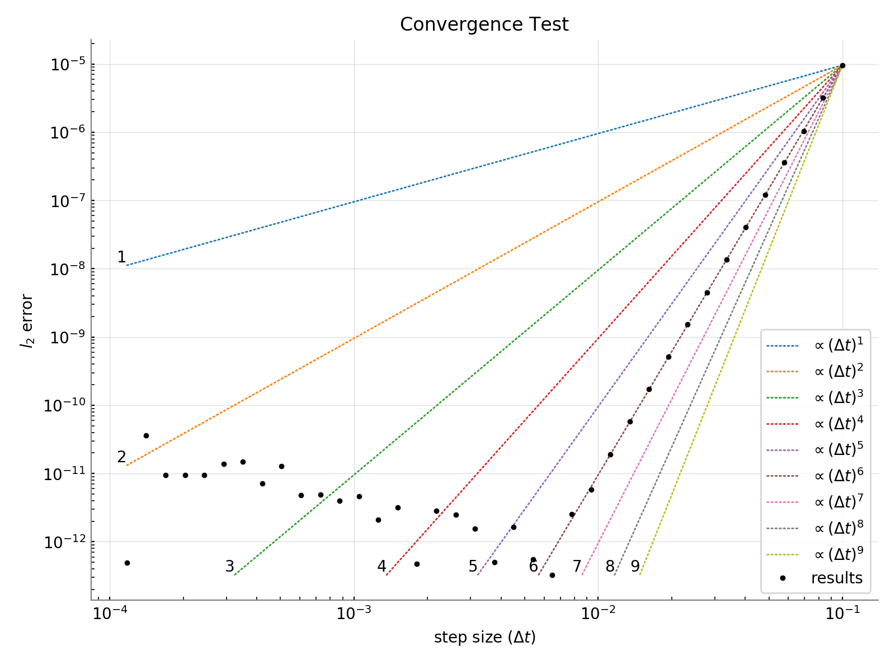

# libode

This repo contains a collection of C++ classes for solving systems of ordinary differential equations (ODEs) in autonomous form. Documentation can be found [here](https://wordsworthgroup.github.io/libode/). All of the solvers are single-step, Runge-Kutta-like methods. There are explicit, adaptive solvers up to the ninth order. The repository also includes Rosenbrock methods, a singly-diagonal implicit Runge-Kutta (SDIRK) method, and several fully implicit Runge-Kutta methods.

These classes were originally styled after Chris Rycroft's [example classes](https://github.com/chr1shr/am225_examples/tree/master/1a_ode_solvers). The class structure of the solvers makes it easy to build a templated integrator on top of an arbitrary solver class and switch the solver with only a few keystrokes. Implicit methods can be given a function for the ODE system's Jacobian or, if none is provided, the Jacobian is estimated.

Several of the solvers and much more detail on the methods can be found in these amazing books:
* Hairer, E., Nørsett, S. P. & Wanner, G. Solving Ordinary Differential Equations I: Nonstiff Problems. (Springer-Verlag, 1987).
* Hairer, E. & Wanner, G. Solving Ordinary Differential Equations II: Stiff and Differential-Algebraic Problems. (Springer, 1996).

The table below lists all the solvers and gives some basic information about them. Papers and/or links to the derivation or original publication of the solvers are often copied in the source headers for the solvers and included in the documentation. Some work still needs to be done, and a list of things to implement is in the `todo.txt` file.

Method | Class Name | (ex/im)plicit | adaptive? | stages | order | stability
 --- | --- | --- | --- | --- | --- | ---
Forward Euler | `OdeEuler` | explicit | no | 1 | 1
Trapezoidal Rule | `OdeTrapz` | explicit | no | 2 | 2
Strong Stability-Preserving, Order 3 | `OdeSsp3` | explicit | no | 3 | 3
Runge-Kutta-Fehlberg (3)2 | `OdeRKF32` | explicit | yes | 3 | 3
RK4 | `OdeRK4` | explicit | no | 4 | 4
Runge-Kutta (4)3 | `OdeRK43` | explicit | yes | 5 | 4
Cash-Karp | `OdeRKCK` | explicit | yes | 6 | 5
Dormand-Prince (5)4 | `OdeDoPri54` | explicit | yes | 7 | 5
Jim Verner's "most efficent" (6)5 | `OdeVern65` | explicit | yes | 9 | 6
Jim Verner's "most efficent" (7)6 | `OdeVern76` | explicit | yes | 10 | 7
Dormand-Prince (8)7 | `OdeDoPri87` | explicit | yes | 13 | 8
Jim Verner's "most efficent" (9)8 | `OdeVern98` | explicit | yes | 16 | 9
Rosenbrock 4(3) | `OdeGRK4A` | implicit | yes | 4 | 4 | A
Rosenbrock 6 | `OdeROW6A` | implicit | no | 6 | 6 | A
Backward Euler | `OdeBackwardEuler` | implicit | no | 1 | 1 | L
Gauss 6th Order | `OdeGauss6` | implicit | not yet | 3 | 6 | A
Lobatto IIIC 6th Order | `OdeLobattoIIIC6` | implicit | not yet | 4 | 6 | L
Radau IIA 5th Order | `OdeRadauIIA5` | implicit | not yet | 3 | 5 | L
Geng's Symplectic 5th Order | `OdeGeng5` | implicit | no | 3 | 5 | A?
SDIRK 4(3) | `OdeSDIRK43` | implicit | yes | 4 | 4 | L

## Compiling

First, before any of the `libode` classes can be compiled, you must copy the `_config.mk` file to `config.mk` and edit that file to specify the compiler settings you'd like the Makefile to use. This shouldn't be complicated. If you are using a current version of the GNU C++ compiler (g++), no changes to the contents of the template config file are needed. There are also commented lines for use with the Intel C++ compiler (icpc), if that is available. To compile all the classes, simply run `make` in the top directory.

The Makefile compiles all of the necessary code into the `obj` folder, then archives it in the `bin` directory as a file called `libode.a`. To use the solvers, you can link `libode.a` (in the `bin` directory) or the object files directly (in the `obj` directory) when compiling your derived class. You must also the the header files in the `src` directory, as there is not a single header file for the library. All of the classes have their header file name displayed in the documentation. Linking the solver classes requires something like `-I<path>/libode/src -L<path>/libode/bin -lode` when compiling derived code, with `<path>` replaced by path elements leading to the libode directory.

Test programs are compiled with `make tests` and they can all be run in sequence with the `run_all_tests.sh` script (which uses Python to plot the test results).

## Using the Solvers

To integrate a specific system of ODEs, a new class must be created to inherit from one of the solver classes. This new inheriting class must
1. Define the system of ODEs to be solved by implementing the `ode_fun` function. This is a virtual function in the base classes. Once it is implemented, it can be used by the stepping and solving functions.
2. Set initial conditions in the `sol` variable, which is an array with the same length as the system of ODEs.
3. Optionally implement the `ode_jac` function for implicit methods. This is also a virtual function in the base classes. If it's not overridden, a finite-difference estimate of the Jacobian is used.

For flexibility, the derived class could be a template, so that the solver/method can be chosen when the class is constructed. Other than defining the system of equations and setting initial conditions, the derived class can store whatever information and implement whatever other methods are necessary. This could be something simple like an extra function for setting initial conditions. It could, however, comprise any other system that needs to run on top of an ODE solver, like the spatial discretization of a big PDE solver.

Each solver has a `step` method that can be used to integrate a single step with a specified step size. Each solver class also has a `solve_fixed` method and, if it's an adaptive class, a `solve_adaptive` method. These functions return nothing and both have the same four call signatures:

1. `void solve_fixed (double tint, double dt)`

   Simply advances the solution for a specified length of the independent variable. The independent variable is assumed to be time, so `tint` is the integration time and `dt` is the time step to use (or the initial time step for adaptive solves).

2. `void solve_fixed (double tint, double dt, const char *dirout, int inter)`

   Integrates for a duration of `tint` using time step (or initial time step) `dt` and writes solution values after every `inter` steps to the directory `dirout`. For example, if `inter` is one, the solution at every step is written to file. If `inter` is two, every other step is written.

3. `void solve_fixed (double tint, double dt, unsigned long nsnap, const char *dirout)`

   Integrates and writes `nsnap` even spaced snapshots of the solution into the directory `dirout`.

4. `void solve_fixed (double dt, double *tsnap, unsigned long nsnap, const char *dirout)`

   Integrates and writes snapshots at the times specified in `tsnap` into the directory `dirout`.

## Examples

Several example programs for interesting/famous systems of ODEs are in the "examples" folder. In each of the example directories, the programs can be compiled, executed, and plotted simply by running the `run.sh` script (assuming the `config.mk` file is set up for compiling). These programs are good examples of how to put everything together and use the solvers. To run all the examples in sequence and look at the plotted results, run the `run_all_examples.sh` script.

## Testing

The convergence and accuracy of all the solvers have been tested using a few programs with source files in the "test" directory and executables named `bin/test_*`. Python scripts to plot the output of these programs are named `scripts/plot_*`. All these tests can be compiled, run, and plotted with the `run_all_tests.sh` script. Individual tests can be run through the `test.sh` script. For example,
```
./test.sh adapt
```
will compile and run the `test_adapt.exe` program, then plot the results (assuming Python and matplotlib are available). The image below shows the results of this program using the adaptive, fifth order `OdeDoPri54` class to solve a system of two coupled oscillators. The plot was generated from the top directory with these commands:



The `test_work` program examines how many function evaluations (the number of times the system of ODEs is evaluated) are required for different levels of accuracy for several methods. Each method solves an identical initial value problem and the final values are compared to a known solution. The plot below, generated with `./test.sh work`, shows the results. As expected, but still amazingly, the eighth order method of Dormand and Prince (`OdeDoPri87`) achieves error reduction by a factor of about 100,000,000 when the number of function calls is increased by a factor of 10.



Another test program, `test_conv`, can be used to confirm the order of accuracy of different methods. Below are the results for the sixth order, fully-implicit Lobatto IIIC method. The black dots fall neatly along a line proportional to the sixth power of the step size until machine precision is reached for the global error, confirming the expected order of accuracy.


